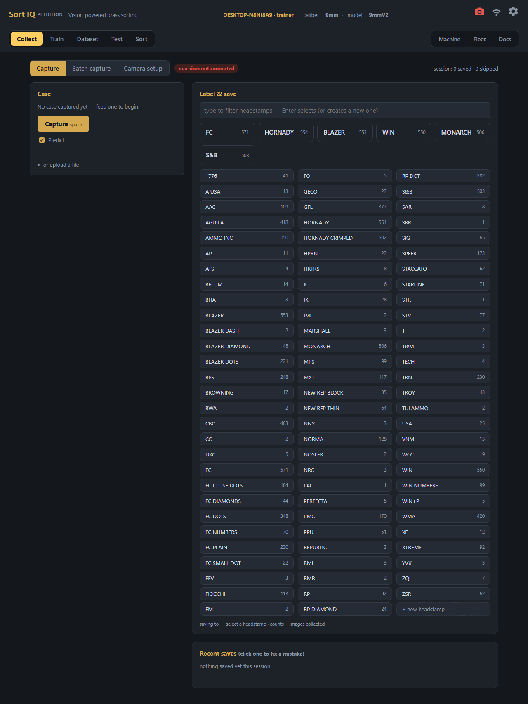
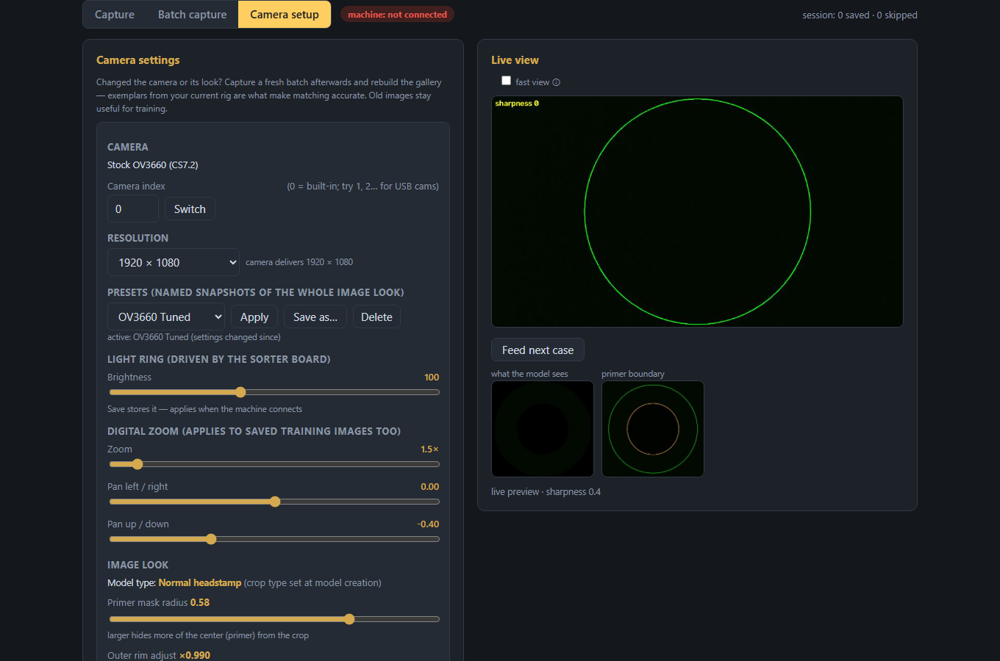
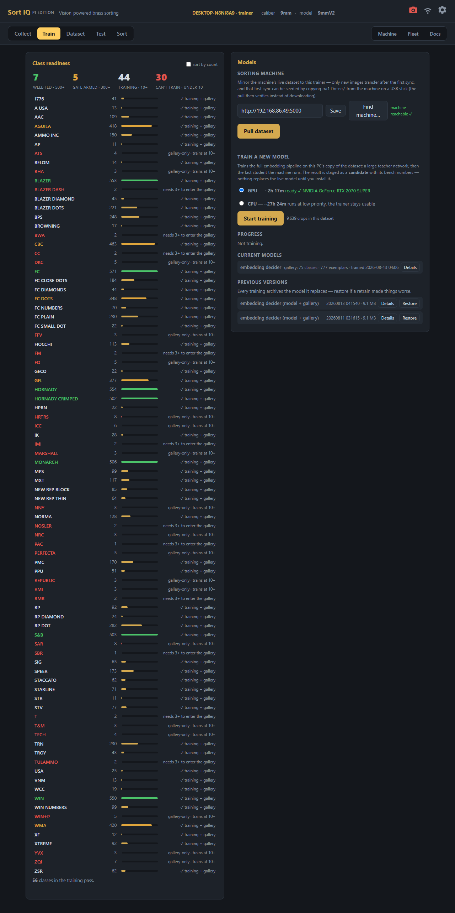
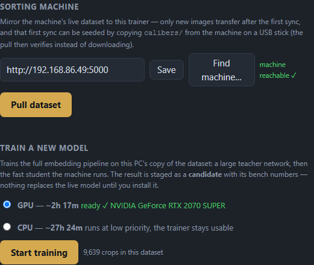
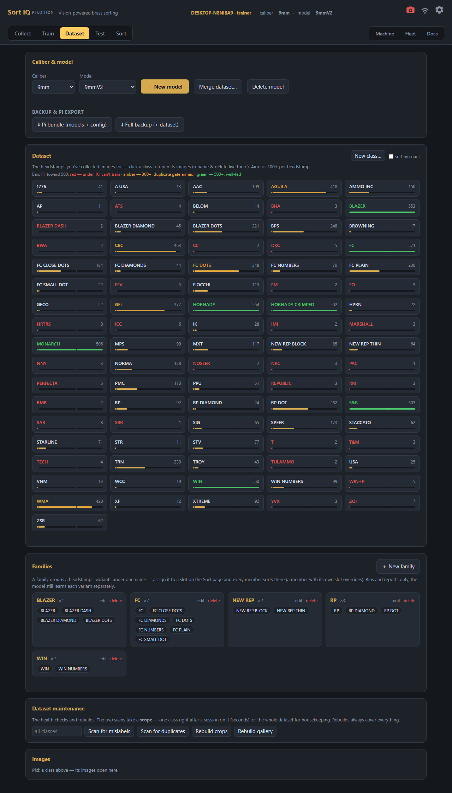
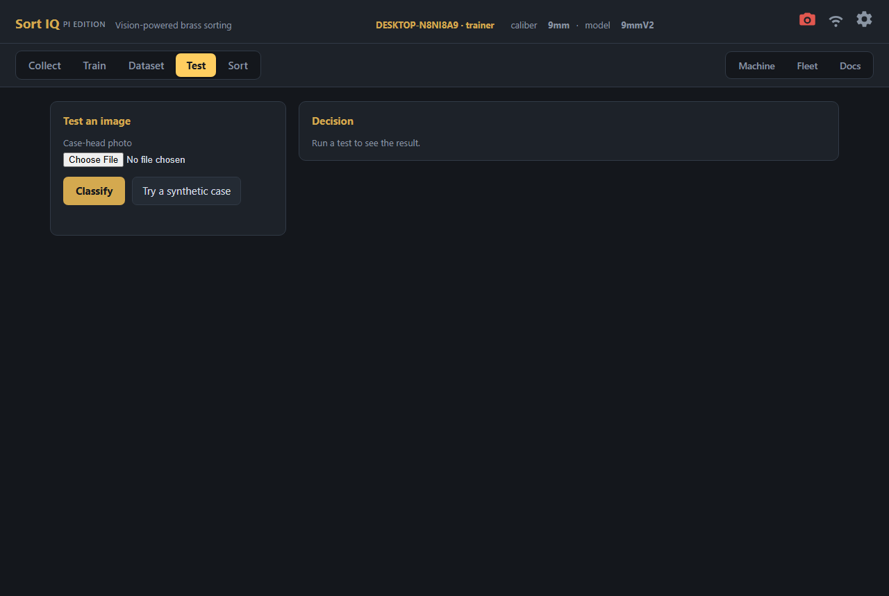
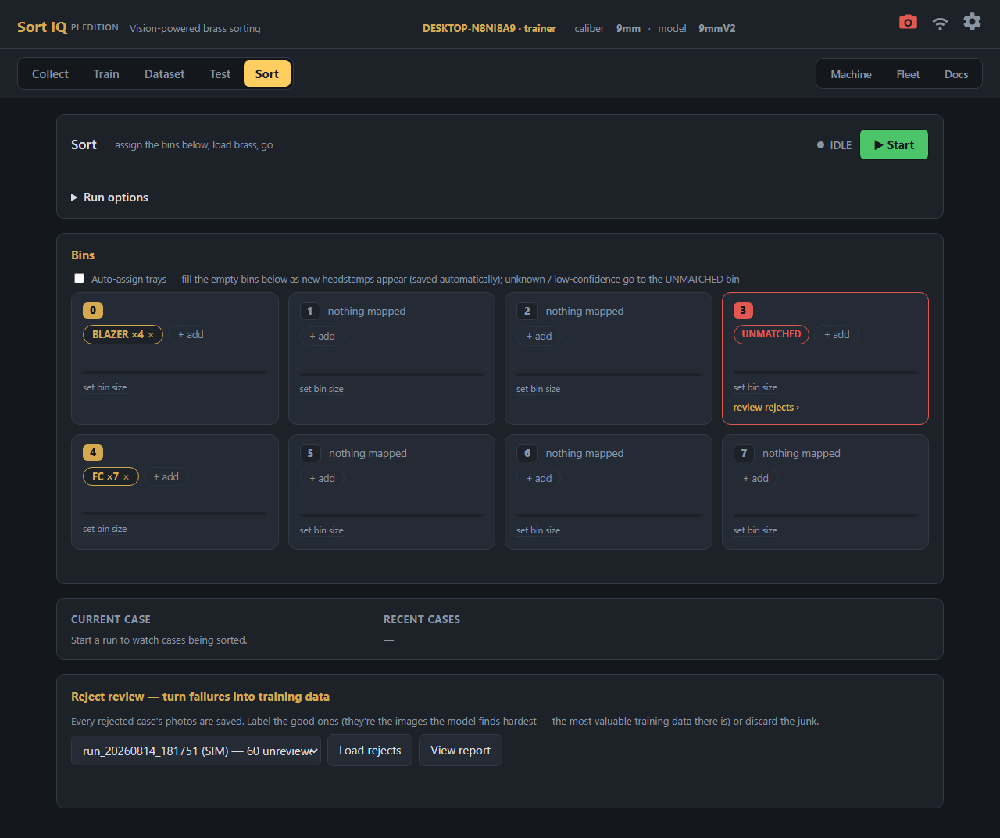
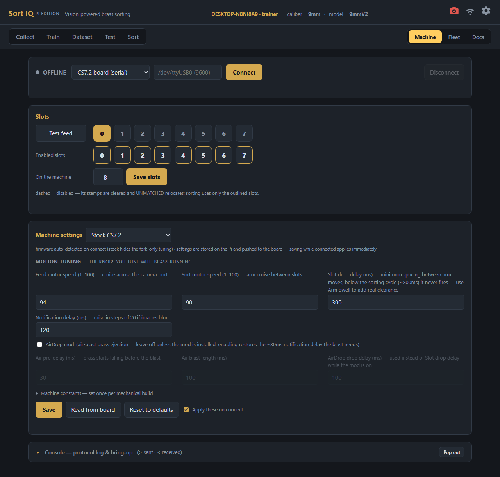

# SortIQ User Manual

Everything is driven from a browser. Open **http://pisortiq.local:5000**
(or the Pi's IP address) from any computer, phone, or tablet on your
network. The screenshots below are from a live machine mid-project, so
what you see here is what real use looks like. (New install? The
step-by-step path is [QUICK_START.md](QUICK_START.md).)

**What you need:** the assembled CS7.2 machine with its Raspberry Pi set up
([PI_SETUP.md](PI_SETUP.md)), and — when you're ready to train models — any
Mac or Windows PC on the same network ([TRAINER_SETUP.md](TRAINER_SETUP.md)).

**The header** (top of every page) is the machine's vital signs: active
caliber and model profile, camera status, and network/IP readout. If
something's disconnected, it shows there first.

The nav reads left to right in workflow order — **Collect** images →
**Train** models → curate the **Dataset** → **Test** decisions → **Sort**
— with the system pages (Machine, Fleet, Docs) in their own group on the
right. The whole top bar tucks away as you scroll down a long page and
returns the instant you scroll up.

---

## Collect — building your dataset

This is where a model is born: you feed cases and tell SortIQ what they are.

1. Make sure the machine chip (next to the view toggle) is green —
   `machine: CS7.2 serial`.
2. Pick the headstamp you're feeding: the **top row** is your six biggest
   classes as instant-select buttons, and below it every class lists
   alphabetically (or type in the filter box — Enter selects, or creates
   a new class). The number on each button is how many images that class
   has.
3. Press **Feed case** (or the spacebar). The machine feeds a case, the
   camera captures it, and the image saves to the selected class.
4. With **Predict** checked, the current model guesses each case as it's
   captured — once your model is decent, you mostly just confirm.
5. Mislabeled one? **Recent saves** shows the last few captures — click one
   and its head crop expands to a reviewable size above the controls, so
   you can double-check the stamp before you move or delete it.

A class starts **sorting from 3 photos** (it enters the exemplar gallery)
and joins the training pass at 10+; aim for 100–300 for the stamps you
care most about. At 300+ a save is skipped only when it's **pixel-verified
as the same physical case already filed** (matching scratch pattern at
some rotation — the re-run-the-brass situation). Distinct cases always
file, no matter how alike the stamp looks.

At **500+ images a class is "well-fed"** and switches from volume to
variety: in batch review its confirm-card offers **File novel**, which
keeps only photos that show the class a look it doesn't already hold in
depth, and skips the routine near-identical ones ("98 routine
look-alikes skipped"). **File all** overrides. Hard cases — the
"Looks like X" and unknown piles — always file in full; those are the
photos that teach the model the most. Each of those cards also explains
*why* the model hesitated: "FC 98% **vs R-P 94%**" means the winner was
confident but a look-alike class sat too close to auto-file.

**A note on variant classes:** if a headstamp arrives in visibly
different dies (`FC` plain vs `FC DOTS` vs `FC DIAMONDS`), give each
look its **own class** — a variant hiding inside its parent class
matches at coin-flip margins, while a split class matches decisively
after the next retrain. Then group the variants into a **family**
(Dataset tab) and assign the family to a bin: they sort together
physically, and a close call between two family members headed to the
same bin is accepted rather than rejected as ambiguous. The full
doctrine, including when a split is worth it and how to keep classes
clean: [TRAINING_GUIDE.md](TRAINING_GUIDE.md).

## Camera setup

The **Camera setup** toggle (top of the Collect tab) is the machine's eye
exam:

- **Camera** — the stock OV3660 is auto-detected; the page offers the
  controls that actually matter: resolution, the **light ring** slider
  (driven by the sorter board — the board must be powered for light),
  and **digital zoom/pan**.
- **Live view** — with the head-detect circle and a live sharpness number
  (use it when focusing the lens). **Feed next case** cycles brass without
  leaving the page. Below it: the exact crop the model will see.
- **Image look** — the crop dials (primer mask radius, rim adjust). These
  belong to the *model profile*, not the camera, and are always safe to
  change: crops rebuild from the raw images.

**Consistency matters:** the model learns the camera's exact look, so
avoid changing optics or lighting mid-dataset. If you change the setup
meaningfully, capture a fresh batch afterwards and rebuild the gallery so
the exemplars match what the camera now sees.

---

## Train — on your trainer PC

> **How you structure your classes matters more than how long you
> train.** [TRAINING_GUIDE.md](TRAINING_GUIDE.md) covers the doctrine:
> split every visually distinct variant into its own class, rejoin
> them with families for the bins, and keep the dataset clean with the
> scan loop. Ten minutes of reading that pays for itself in margins.

The Pi deliberately doesn't train (it's an inference machine — no
TensorFlow). Training runs on the trainer: the same SortIQ app running
on your Mac or Windows PC ([TRAINER_SETUP.md](TRAINER_SETUP.md)) — but
you drive it **from the machine's own page**: the Train tab's **Train
models…** button opens a window that finds the trainer on the PC you're
browsing from and walks the whole flow — sync the dataset, pick GPU or
CPU, watch progress, review the result's bench numbers, and install —
without ever leaving the machine's UI. (The trainer's own page at
`http://localhost:5000` offers the same controls if you prefer it.)

**Class readiness** opens with the dataset's health at a glance — four
jumbo tier counts: well-fed · 500+,
gate armed · 300+, training · 10+,
and can't train · under 10 (the
re-photo shopping list). Below, every class shows its image count and a
**bar filling toward 500**, with tick marks at the 10-image training
gate and the 300-image duplicate gate — a class closing on a gate is
visible at a glance. Every class with 3+ photos is live in the gallery
immediately — sortable today, no training needed; classes join the
periodic training pass (which sharpens the whole network) at 10+
images. Nothing is ever guessed: a class too thin to match confidently
sorts as *unmatched*. The list sorts A–Z or by count. While a sync or
training runs from the
**Train models…** window, the window stays up on purpose: leave the
machine idle until the job finishes (one heavy thing at a time).

Set the **Sorting machine** URL once ("machine reachable ✓" confirms it),
then:

- **Pull dataset** — mirrors the machine's dataset to the trainer
  (incremental — after the first sync only new images transfer) and
  rebuilds the training crops. This mirrored copy feeds the embedding
  retrain when you run one.
- **Find machine…** — scans the local network for SortIQ instances and
  sets the URL with one click; works even when `.local` names don't
  resolve.
- **Train a new model** — a full retraining of the embedding network,
  run from the mirrored dataset. Pick **GPU** (about an hour, when the
  trainer PC has the WSL GPU sandbox set up) or **CPU** (an overnight
  job at low priority — the PC stays usable), press Start, and watch
  the two stages: the large teacher network, then the fast student the
  machine actually runs. The result is staged as a **candidate** with
  its bench numbers — nothing changes on the machine until you press
  **Install**, which archives the current generation and pushes the new
  model + gallery pair over. If the GPU path fails, the app shows the
  error and asks: retry the GPU, or train on CPU instead? It never
  falls back silently.

If the trainer's code doesn't match the machine's, both Train UIs say so
and block training — models must be built by the same imaging code the
machine sorts with. One click (**Update trainer from machine**) brings
the trainer to the machine's exact code and restarts it; details in
[TRAINER_SETUP.md](TRAINER_SETUP.md). The header of every install shows
its version as `v·<digest>` — comparing two headers at a glance tells
you whether machine and trainer are in step (`·git` marks a dev checkout,
which updates via git instead).

The **Current models** card shows the installed embedding decider with
its gallery stats (classes × exemplars). **Every install archives the
generation it replaces** — model and gallery together — so if a new
generation performs worse, restore the previous one from the *Previous
versions* list. Every row has a **Details** button.

Why an embedding model? Instead of being forced to pick one of its
trained classes, it produces a fingerprint that's *matched* against a
gallery of exemplar photos — so a stamp it has never seen matches nobody
and goes to UNMATCHED instead of a bin, and a brand-new class starts
sorting from 3 photos with no retraining at all.

---

## Dataset — curating your classes

- **Caliber & model** — profiles are fully self-contained (dataset, crop
  settings, trained models). Create a new model to experiment — e.g. a new
  camera or crop style — or for a **second caliber**, without touching your
  proven one. Switching is instant. When creating one, **Start with the
  current recognizer** (on by default) lends the new profile your trained
  model's eye: it can tell headstamps apart even on brass it has never
  seen, so a new caliber can collect photos, rebuild its gallery, and
  start sorting immediately — train its own recognizer later for full
  accuracy. **Merge dataset…** copies another model's images into the
  active one, class by class (new classes are created, the source is
  left untouched; trained models are never merged) — the tool for
  consolidating an experiment's labels back into a main model.
- **Per class:** every class is a **card** — name, count, and the same
  readiness bar as the Train tab. Click a card to open the class's
  images (inspect, move mislabeled images between classes,
  bulk-delete). **Rename…** and **Delete class…** sit on the brass
  banner above the images — rename onto an existing class's name to
  **merge** into it. The grid sorts A–Z or by count — count order
  doubles as the "what needs photos" view.
- **Exemplars** — when viewing a class, a dedicated card shows exactly
  which photos are doing the matching for it (★ picked automatically for
  coverage, 📌 pinned by you). Click a badge to pin a photo permanently
  into the gallery or exclude a bad one; changes take effect at the next
  gallery rebuild.
- **Families** — group a headstamp's variants (`FC`, `FC DOTS`,
  `FC PLAIN`…) under one name; each family renders as a small card with
  the family name on top and its member classes as chips inside. On the
  Sort page the family assigns to a
  slot as a single unit, and run reports label the slot by the family.
  Grouping affects bins and reports only — the model still learns and
  reports each variant separately, so classes can multiply for accuracy
  while your physical bins stay simple. **Suggest members** pre-ticks
  every class starting with the family's name. Families also soften the
  "too close to call" gate in the one case where it can't matter: a
  coin-flip between two variants that share a family *and* a slot sorts
  anyway — the case lands in the same chute either way — while variants
  routed to different slots keep the strict gate.
- **Set aside — identify later** — the tray at the top of the page
  collects unknown stamps from reject reviews and captures, clustered by
  similarity. Name a group once to create its class and file every photo
  in one go; discard what you don't want. The tray exists to be emptied.
- **Dataset maintenance** — a dedicated card holding the health checks
  and rebuilds below. The two scans take a **scope**: pick one class for
  a seconds-fast check right after a session on it, or *all classes* for
  full housekeeping. Rebuilds always cover everything.
- **Rebuild crops** — force-regenerates training crops from the raw
  images. Normally automatic; use it if you've changed files outside the
  app.
- **Rebuild gallery** — re-picks every class's exemplars from the current
  photos and pins. Run it after a relabeling session, after emptying the
  tray, or after big captures. Unchanged photos reuse their stored
  vectors, so rebuilds finish in seconds — only a model install (new
  vector space) or an imaging change pays the full price once.
- **Scan for mislabels** — the decider second-guesses every stored
  image, exactly the way live sorting reads a case — with one twist:
  each image's own gallery seat is masked while it's judged, so a
  mislabel that happens to be serving as an exemplar can't vouch for
  itself and hide. Anything that reads
  as a *different* class gets listed, sorted by confidence: the red
  high-confidence flags (70%+) are almost always saves that landed in
  the wrong folder mid-session — **View** jumps straight to the image so
  you can Move or Delete it. Low-confidence rows are usually just hard
  images (worn stamps, glare); leave them unless the photo agrees.
  The scan reads stored vectors, so the whole dataset checks in
  seconds — run it freely after big collection sessions and before
  retraining, and re-scan after fixing (mislabels can shelter each
  other; a clean dataset scans clean twice).
- **Scan for duplicates** — finds repeats of the *same physical case*
  (double-saves, the same brass re-run through batch capture) that
  inflate class counts without adding variety. Two stages: the
  embedding nominates look-alike candidates, then a pixel-level check
  confirms identity by matching the actual scratch pattern at every
  rotation — so genuinely different cases of a uniform stamp (which
  really do look alike) don't get flagged. Each confirmed group shows
  its photos with the sharpest marked **keep**: one click keeps it and
  deletes the rest, or **Different cases — keep all** if you disagree —
  nothing is ever deleted automatically, and a keep-all verdict is
  **remembered**: neither a page reload nor any future scan re-flags a
  pair you've already ruled on. Rebuild the gallery when you're done.

## Test — one case, every detail

**Feed next case** runs one feed cycle and seats the next case under
the camera, so single-case checks are a self-contained loop right on
this page: feed, classify, feed again — no run, no other tab.

Feed a case (or upload an image) and see the entire decision the way the
run loop makes it: every gate (sharpness, class bar, runner-up margin,
rotation agreement) with its pass/fail value, the closest gallery matches
with their similarities, the exact crop the model saw, and the destination
bin. A reject explains itself in plain language ("Too close to call —
SPEER 91% vs BLAZER 89%"). When a sort surprises you, this page is where
you find out why in ten seconds — and the runner-up trail is how
mislabeled images get caught.

## Sort — live sorting

The page is a grid of **slot cards** — one card per physical bin — under
a top bar that follows the machine's state: **Start** when idle, live
stats and **Stop** while sorting, the finished tally afterwards.

1. **Assign bins on the cards.** Click **+ add** on a card and type —
   the picker filters as you go and offers classes, **families**
   (assigning one puts every member class in that slot with one pick,
   future members included; a member explicitly assigned to its own
   slot overrides its family), and the two special tokens. Exactly one
   card is **UNMATCHED** (red) — the catch-all where rejects land.
   Optionally give a second card **OVERFLOW** (blue): confidently-read
   stamps that have no bin of their own land there instead of riding
   the catch-all, so UNMATCHED holds only true rejects. Or leave cards
   empty and turn on **auto-assign** — new stamps claim free slots as
   they appear, and the assignments persist for next time.
2. **Set bin sizes** (optional, once): **set bin size** under a card's
   fill bar stores that tray's physical capacity. A sized bin's fill
   bar turns absolute — amber at 80% full, red with a **FULL** flag
   when the tray needs emptying; hover for the exact count/capacity.
   Unsized bins show fill relative to the busiest bin. Sizes live in
   machine settings, so they survive model switches.
3. **Start.** The grid locks into a live dashboard: jumbo per-card
   counts, per-class breakdowns, fill bars, and a glow tracking the
   drops, while the top bar carries sorted / unmatched / jams / rate.
4. Anything below the confidence floors goes to **UNMATCHED** — the
   machine would rather make you re-run a case than put it in the
   wrong bin. (The **Acceptance** slider in the run options shifts
   every class's bar together; 85% is neutral.)
5. When the hopper runs dry the run **ends itself**: the last cases
   still inside the feed wheel are flushed to their correct slots, and
   the finished bar adds duration, seconds-per-case, and median
   confidence. The cards become the report's table of contents:
   **view cases ›** on any card opens that bin's section — a brass
   banner naming what the slot held, cases grouped by class, assigned
   classes leading and riders labeled. The UNMATCHED card offers
   **review rejects ›** and, when classified cases rode the catch-all,
   **view bin ›** for them.
6. **Reject review** — every unmatched case was photographed. One click
   labels it into the training data, so your next model learns from
   exactly what confused this one. For **past runs**, pick one in the
   review card's dropdown: **View report** paints its complete per-bin
   report, **Load rejects** its rejects.

## Machine — connection, calibration, settings

- **The machine bar** — the connection as a status line: offline it
  carries the target, port, and **Connect**; connected it folds to a
  green dot, the board-and-port summary, and **Disconnect**.
- **Slots** — one aligned grid of number badges (the same badges as the
  Sort page's bin cards). **Test feed** drops a case at the brass-filled
  slot — click any number to sort test feeds there. Below it, the
  **enabled slots** row: click a badge to toggle it (dashed = disabled:
  sorting and auto-assign skip it, any stamps assigned to it are
  cleared, and UNMATCHED relocates if needed), then **Save slots**.
- **Slot calibration** (SortIQ firmware fork) — jog each slot's arm
  position in microsteps until the chute centers over its funnel; each
  press moves the real arm so you see the true stop.
- **Machine settings** — speeds, currents, homing offsets, delays. Stored
  on the Pi and pushed to the board on every connect (the board doesn't
  keep them). Safe to experiment with: every value is clamped to a
  hardware-safe range on save, and **Reset to defaults** brings back the
  bench-proven setup. The page also adapts to your board's firmware
  (auto-detected on connect): on stock CS7.2 firmware the fork-only
  tuning and slot calibration are hidden, since that board ignores them.
  If your machine has the **AirDrop mod** (air-blast brass ejection),
  tick its checkbox here — it defaults to off so unmodded machines
  never pay its delays. Enabling it restores the small notification
  delay the blast needs and switches the arm's drop timing to the
  AirDrop drop delay (used instead of Slot drop delay while the mod
  is on); disabling reclaims the delay again.
- **Console drawer** — folded at the bottom until you need it: the raw
  serial conversation with the board, the bring-up commands (home
  feeder/sorter, get config, ping, version, stop/cancel), and a
  terminal for hand-typed firmware commands. **Pop out** floats the
  log over any tab.

## Running more than one machine

The **Fleet** tab (on every machine and trainer) is the collective
view: one card per known machine — name, active model, camera/board
health, a live line while it captures or sorts, and its build. Click a
name to open that machine's own page; **Scan for machines** finds
peers, and **Update from here** brings a machine on an older build up
to the one you're browsing. The page you're on does the polling, so
the view works from any phone or PC with no trainer involved, and only
while the tab is open.

Each machine is self-contained — its own address, name, dataset, and
model — and one trainer PC serves them all. Four rules keep a fleet sane:

- **Unique hostname per machine, set at flash time.** A machine answers
  at `<hostname>.local:5000` (`pisortiq.local:5000`,
  `pisortiq2.local:5000`, …). Two Pis sharing a hostname make that
  `.local` name flip-flop between them — never duplicate one. The
  trainer's **Find machine…** button discovers every machine on the
  network without typing names, and works even when `.local` resolution
  is being moody. For machines that matter, give each a **DHCP
  reservation** in your router and use the IP — mDNS is a convenience,
  reserved IPs are dependable.
- **Name your machines.** Click the name in the page header to label a
  machine ("9mm Master", "Shop Left"). The name shows in the header, the
  browser tab title, and the Find-machine list — so five open tabs stay
  tell-apart-able. It's a display label only: renaming never moves files
  or breaks anything.
- **Give each machine's model a unique name.** This is the load-bearing
  rule. The trainer stores its dataset mirrors by *caliber/model* — not
  by machine — so two machines both running `9mm/Default` would map to
  the same trainer folder. The trainer refuses to pull the second
  machine into the first one's mirror (it tells you to rename), so
  nothing mixes silently — but the fix is the convention: name the model
  after the machine's job (`9mm/Master`, `9mm/Secondary`). Each machine
  then gets its own folder on the trainer, switchable with the Dataset
  page's Caliber & model selector.
- **The trainer works with one machine at a time.** Point the machine
  URL (Train page) at whichever machine you're serving — Find machine…
  sets it in one click — and switch the active profile to match. If the
  URL and profile ever disagree, the trainer blocks the pull or install
  and says so.

## The Uno firmware — stock or SortIQ fork?

**SortIQ works out of the box with the stock CS7.2 firmware** — no
flashing required. Everything that matters runs on it: collecting,
training, live sorting, the end-of-brass flush, jam recovery. The app
only ever speaks the stock command set for sorting.

The optional **SortIQ firmware fork** (version `…-SS2`, in
[firmware/](../firmware/README.md)) adds machine-quality upgrades:

- **Per-slot calibration** — jog each slot's arm position in microsteps
  so every chute centers exactly over its funnel (the stock firmware
  uses a rigid evenly-spaced grid)
- **Smoother, faster motion** — true trapezoid acceleration (slot moves
  are also ~30% quicker)
- **More repeatable homing** — a two-stage seek that takes the sensor
  edge at low constant speed every time
- **Feed motion profile** tuned for the camera port and tensioner
- **Pipelined sorting** — the mechanical cycle runs *under* the model's
  think time instead of after it, buying real cases-per-minute
- **Arm dwell** — an adjustable hold before every arm move, clearance
  for brass that tumbles slowly down the arm tube
- **Homing telemetry** — the run banner can show feed-wheel drift, an
  early jam predictor

On stock firmware those extras degrade silently and safely: the
calibration and motion settings are acknowledged by the board but have
no effect, and telemetry simply doesn't appear. Nothing breaks.

**Which one am I running?** The Machine tab's Board-firmware selector
auto-detects on connect; or type `version` in the console — stock
answers `7.2.250925.6.1`, the fork with an `-SS2` suffix. Flashing is
covered in [firmware/README.md](../firmware/README.md) — a five-minute
job from the Pi over the existing USB cable; the stock firmware in
[Seth's repo](https://github.com/sjseth/AI-Case-Sorter-CS7.2) is the
flash-back rollback.

## Docs

The **Docs** tab carries the full built-in reference: the decision flow,
the serial protocol, a training playbook, floor-tuning guidance, and
troubleshooting — always matching the version you're running.

---

## Tips & troubleshooting

- **`pisortiq.local` won't load** — mDNS being moody; use the Pi's IP
  address (your router's device list has it).
- **Board link drops when motors run** (disconnects mid-run, `err -71`
  storms in the Pi's logs) — that's electrical noise from the steppers
  feeding back through USB. The fix is a cheap USB isolator on the
  board's serial line plus proper machine grounding — see the wiring
  notes in [PI_SETUP.md](PI_SETUP.md). (Camera stays plugged into the
  Pi directly — isolators are too slow for it.)
- **Camera drops mid-run** (cases land in the catch-all unphotographed;
  `uvcvideo … -71` storms in the Pi's logs) — same electrical noise,
  different victim. A shielded, ferrite-choked USB cable on the camera,
  routed away from the motor wiring, ended it here. If the camera stays
  wedged after a drop, unplug/replug its USB — the app reconnects
  automatically.
- **A new model generation made accuracy worse** — Train tab → *Previous
  versions* → restore (the model and its gallery restore together). Then
  look at what changed: usually a mislabeled batch (Dataset gallery) or
  an over-split variant class.
- **Lots of "too close to call" rejects for one make** — either two of
  your classes overlap (an over-split variant — merge them), or the pair
  genuinely looks alike and needs more photos of both; rebuild the
  gallery after. A single mislabeled image that became an exemplar also
  causes this — run **Scan for mislabels** on both classes.
- **First dataset pull on a new trainer PC is slow** — it's the one-time
  bulk copy over Wi-Fi; ethernet on the Pi speeds it up dramatically. Or
  use the USB shortcut: insert a stick into the machine, click **Copy
  dataset to USB stick…** on its Train tab, and a popup handles the rest —
  mount, copy with live progress, then **Close & eject** unmounts it and
  says "safe to remove." Drop the stick's `SortIQ/calibers` folder into
  the repo folder on the PC and the pull verifies instead of
  transferring. Re-exports to the same stick only copy new images.
- **Deep links** — every tab is linkable: `#collect`, `#camera`, `#train`,
  `#dataset`, `#test`, `#run`, `#machine`, `#docs`.
